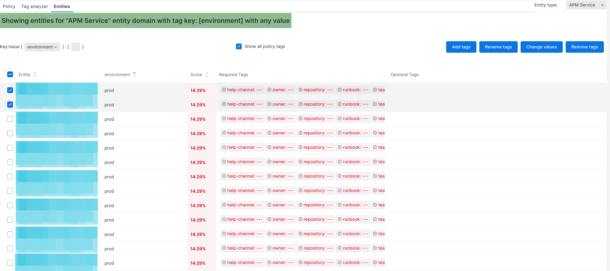

[](https://opensource.newrelic.com/oss-category/#new-relic-one-catalog-project)

# nr1-tag-improver

 [](https://snyk.io/test/github/newrelic/nr1-tag-improver)

## About this Nerdpack

Tag Improver is here to help you get maximum value from New Relic One by simplifying the process of creating and managing a good tagging strategy.

Define the important entity tags for your environment, report on coverage, and view overall tag usage across everything you own.

## What can Tag Improver do for you

### Report on the coverage of key tags across your portfolio based on an editable tag schema


### Report the tags in use (and missing) from each entity, and manually manage tags in bulk



### Explore the full set of tag key:values in use across your account


## Open source license

This project is distributed under the [Apache 2 license](LICENSE).

## What do you need to make this work?

Access to New Relic One and a Full Stack Observability subscription.

Editing tags requires a User-level account.

## Getting started

1. Ensure that you have [Git](https://git-scm.com/book/en/v2/Getting-Started-Installing-Git) and [NPM](https://www.npmjs.com/get-npm) installed. If you're unsure whether you have one or both of them installed, run the following commands. (If you have them installed, these commands return a version number; if not, the commands aren't recognized.)
```bash
git --version
npm -v
```
2. Install the [NR1 CLI](https://one.newrelic.com/launcher/developer-center.launcher) by going to [the developer center](https://one.newrelic.com/launcher/developer-center.launcher), and following the instructions to install and set up your New Relic development environment. This should take about 5 minutes.
3. Execute the following command to clone this repository and run the code locally against your New Relic data:

```bash
nr1 nerdpack:clone -r https://github.com/newrelic/nr1-tag-improver.git
cd nr1-tag-improver
npm install
nr1 nerdpack:serve
```

Visit [https://one.newrelic.com/?nerdpacks=local](https://one.newrelic.com/?nerdpacks=local) to run the app locally.

## Deploying this Nerdpack

Open a command prompt in the app's directory and run the following commands.

```bash
# If you need to create a new uuid for the account to which you're deploying this app, use the following
# nr1 nerdpack:uuid -g [--profile=your_profile_name]
# to see a list of APIkeys / profiles available in your development environment, run nr1 credentials:list
nr1 nerdpack:publish [--profile=your_profile_name]
nr1 nerdpack:deploy [-c [DEV|BETA|STABLE]] [--profile=your_profile_name]
nr1 nerdpack:subscribe [-c [DEV|BETA|STABLE]] [--profile=your_profile_name]
```

Visit [https://one.newrelic.com](https://one.newrelic.com), and launch your app in New Relic.

# Support

New Relic has open-sourced this project. This project is provided AS-IS WITHOUT WARRANTY OR DEDICATED SUPPORT. Issues and contributions should be reported to the project here on GitHub.

We encourage you to bring your experiences and questions to the [Explorers Hub](https://discuss.newrelic.com) where our community members collaborate on solutions and new ideas.

## Community

New Relic hosts and moderates an online forum where customers can interact with New Relic employees as well as other customers to get help and share best practices. Like all official New Relic open source projects, there's a related Community topic in the New Relic Explorers Hub. You can find this project's topic/threads here:

[https://discuss.newrelic.com/t/tag-improver-new-relic-one-nerdpack/125683](https://discuss.newrelic.com/t/tag-improver-new-relic-one-nerdpack/125683)

## Issues / enhancement requests

Issues and enhancement requests can be submitted in the [Issues tab of this repository](../../issues). Please search for and review the existing open issues before submitting a new issue.

## Security

As noted in our [security policy](https://github.com/newrelic/nr1-tag-improver/security/policy), New Relic is committed to the privacy and security of our customers and their data. We believe that providing coordinated disclosure by security researchers and engaging with the security community are important means to achieve our security goals.

If you believe you have found a security vulnerability in this project or any of New Relic's products or websites, we welcome and greatly appreciate you reporting it to New Relic through [HackerOne](https://hackerone.com/newrelic).

# Contributing

Contributions are encouraged! If you submit an enhancement request, we'll invite you to contribute the change yourself. Please review our [Contributors Guide](CONTRIBUTING.md).

Keep in mind that when you submit your pull request, you'll need to sign the CLA via the click-through using CLA-Assistant. If you'd like to execute our corporate CLA, or if you have any questions, please drop us an email at opensource+nr1-tag-imporover@newrelic.com.

## Customizing the Tag Policy

Users can edit the tagging policy in the New Relic One UI but those changes are only visible to the individual user. To customize the default policy, follow these instructions before deploying the app to your account(s).

The Policy report is driven by a policy schema defined in [tag-schema.js](./nerdlets/tag-improver-nerdlet/tag-schema.js)

First, define the set of required and optional tags for your environment.
Edit [tag-schema.js](./nerdlets/tag-improver-nerdlet/tag-schema.js) to reflect your policy.

Each object in the schema JSON should have:

* `key` - the actual tag key as applied to entities in New Relic
* `enforcement` - the schema enforcement level from `TAG_SCHEMA_ENFORCEMENT` (controls presentation on Overview tab)
* `label` - human-readable name of the tag, generally the same or a more verbose version of `key`
* `purpose` - optional, more detailed description of usage or provenance for the tag value

When done, follow the instructions above under **Deploying this Nerdpack** to deploy your changes to your account.
